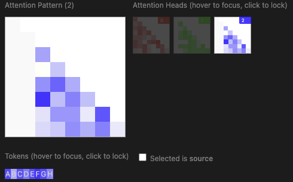

# PySvelte

This is a Python library for displaying web-dev visualisations inside Jupyter notebooks, with a focus on language model interpretability.

Currently the main feature is a unidirectional attention pattern visualiser. Running this in a notebook:

```py
import pysvelte
import numpy as np
tokens = ['A', 'B', 'C', 'D', 'E', 'F', 'G', 'H']
attention_pattern = np.tril(np.random.normal(loc=0.3, scale=0.2, size=(8,8,3)))
pysvelte.AttentionMulti(tokens=tokens, attention=attention_pattern)
```

will yield this interactive widget:



## Installation

```bash
pip install git+https://github.com/neelnanda-io/PySvelte
```

(Or for developing PySvelte, you can `git clone git@github.com:neelnanda-io/PySvelte.git`, `cd PySvelte`, `pip install -e . -U`. This will use your local development version when you `import pysvelte`.)

## Colab

See https://colab.research.google.com/drive/1nbYcUurTIQK4x8wsyd6o-N84a6TKVgyx?usp=sharing for a demo. The process will be simplified in the near future so that you don't need to download node and compile Svelte files unless you need to edit them!

---

## Introduction

If we want to understand neural networks, it's essential that we have effective ways of getting lots of information from the innards of those models into a readable form. Often, this will be a data visualization.

Unfortunately, there's an awkward mismatch between workflows for deep learning research and data visualization. The vast majority of deep learning research is done in Python, where sophisticated libraries make it easy to express neural networks and train them in distributed setups with hardware accelerators. Meanwhile, web standards (HTML/Javascript/CSS) provide a rich environment for data visualization. Trying to use Javascript to train models, or Python for data visualization, takes on a very significant handicap. One wants to use the best tools for each task. But simultaneously working in two ecosystems can also be very challenging.

This library is an attempt at bridging these ecosystems. It encourages a very opinionated workflow of how to integrate visualization into the deep learning research workflow. Our design goals include:
* To make it easy to create bespoke, custom visualizations based on web standards and [Svelte](https://svelte.dev/), and use them in Python.
* To encourage visualizations to be modular and reusable.
* To make it easy to publish persistent visualizations to standalone, sharable pages.
* To allow researchers who don't know anything about web technologies to use visualizations their colleagues create.

## Set Up

Many features in this library (such as publishing visualiations to GCS/S3/AZ buckets), require you to write several functions specific to your own research setup in `config.py`.

## Basic use

The basic idea is that we create a Svelte component inside the `src/` folder, say `src/Hello.svelte`:

```html
<script>
    export let name;
</script>
<h2>Hello {name}!</h2>
```

This visualization automatically becomes available in Python as `pysvelte.Hello()`. This includes tab completion for argument names.

We can now use it as follows.

```py
import pysvelte
pysvelte.Hello(name="World")
```

(A few details: (1) This should work without directly running any npm build process; pysvelte will trigger necessary builds for you from Python, in order to make visualizations easily usable by those without web expertise. (2) Argument names are mandatory, since mapping argument names based on order would be very fragile as the svelte component is edited. (3) In addition to objects with clear javascript analogues, NumPy arrays can be passed into components and will be exposed on the javascript side as SciJs NdArrays.)

In a jupyter or colab notebook, the visualization should automatically display if its the last thing computed in a cell. One can also use `.show()` to show items that aren't the last line:

```py
pysvelte.Hello(name="Alice").show()
pysvelte.Hello(name="Bob").show()
```

Once you configure `config.py` you should also be able to use `.publish()` to publish your visualizations and easily share them. By default, new published visualizations can also be shared on slack to make it easier for your colleagues to discover them, and for convenient sharing when pair programming.

```py
pysvelte.Hello(name="World").publish("~~/hello_world.html")
```

The objects returned when you use a component are `pysvelte.Html()` objects, which can be added together. This is useful to create pages.

```py
html = pysvelte.Html("<h1>My Hellos Page</h1>")
html += pysvelte.Hello(name="Alice")
html += pysvelte.Hello(name="Bob")
html.publish("~~/hellos.html")
```

One final feature we want to highlight is that Svelte components can have companion Python files, like this `src/Hello.py`. This can be used to add doc strings (which appear in tab completion), argument type signatures, do Python-side validation of data for easier debugging, and even modify data before it is passed to Javascript.

```py
def init(name: str):
    """A visualization which says hello to a given name."""
    assert len(name) > 0, "Name can not be empty."
    assert name[0] == name[0].upper(), "Name must be capitalized."
```

## Example component

`src/AttentionMulti.svelte` contains an example of a component we've
developed internally which we use to to visualize attention patterns
from Transformer self-attention blocks. You can [view a rendered
version of (a variant of) this
component](https://transformer-circuits.pub/2021/framework/2L_HP_normal.html)
in our recent paper.

See `src/AttentionMulti.py` for documentation.


## Learn More

On the javascript side, the major things to understand are:

* Web standards (SVG, Canvas, CSS grid, etc)
* [Svelte](https://svelte.dev/)
* [ndarray](https://github.com/scijs/ndarray) (for JS versions of numpy arrays)

[D3](https://d3js.org/) is also helpful!


### License

Copyright 2021 Anthropic

Licensed under the Apache License, Version 2.0 (the "License");
you may not use this file except in compliance with the License.
You may obtain a copy of the License at

    http://www.apache.org/licenses/LICENSE-2.0

Unless required by applicable law or agreed to in writing, software
distributed under the License is distributed on an "AS IS" BASIS,
WITHOUT WARRANTIES OR CONDITIONS OF ANY KIND, either express or implied.
See the License for the specific language governing permissions and
limitations under the License.
